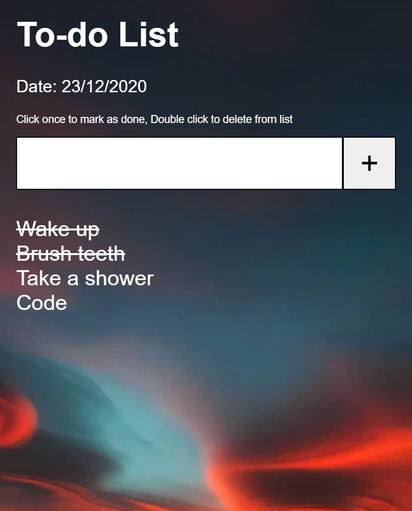

 

  

  <h3 align="center">To-Do List</h3>

  

    An awesome to-do list to boost your productivity
     
     
    <a href="https://github.com/HimalayanPanda/ToDoList"><strong>Explore the docs »</strong></a>
     
     
  

## About The Project

Stay organized and boost your productivity with this simple yet elegant to-do list. Keep track of your tasks and improve your time management skills.

How to use it:

* Add your task into the input field and click on the "+" button

* To cross out a task, just click on it
* If you wanna remove a task double click it

## Built With

Built with HTML, CSS and JavaScript

## Contributing

Contributions are what make the open source community such an amazing place to be learn, inspire, and create. Any contributions you make are **greatly appreciated**.
* If you have suggestions for adding or removing projects, feel free to [open an issue](https://github.com/HimalayanPanda/ToDoList/issues/new) to discuss it, or directly create a pull request after you edit the *README.md* file with necessary changes.
* Please make sure you check your spelling and grammar.
* Create individual PR for each suggestion.
* Please also read through the [Code Of Conduct](https://github.com/HimalayanPanda/ToDoList/blob/main/CODE_OF_CONDUCT.md) before posting your first idea as well.

### Creating A Pull Request

1. Fork the Project
2. Create your Feature Branch (`git checkout -b feature/AmazingFeature`)
3. Commit your Changes (`git commit -m 'Add some AmazingFeature'`)
4. Push to the Branch (`git push origin feature/AmazingFeature`)
5. Open a Pull Request

## License

Distributed under the MIT License. See [LICENSE](https://github.com/HimalayanPanda/ToDoList/blob/main/LICENSE.md) for more information.

## Authors

* **Aditya Raj Pandey** - *Software Engineering Student* - [Aditya Raj Pandey](https://github.com/HimalayanPanda) - *Built To-Do List*

## Acknowledgements

* [ShaanCoding](https://github.com/ShaanCoding)
